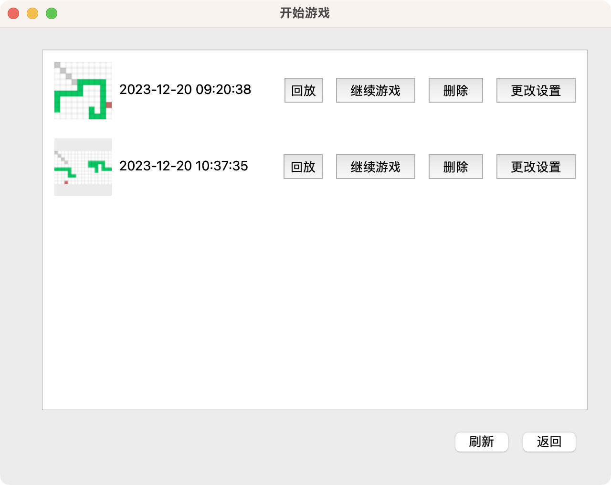

# 大作业报告
#### 小组人员信息（姓名、学号、班级）
谭萱2021011229 美110
苏宇然2021_ 美110
### 项目运行环境
|环境类型|说明|
|:---:|:---:|
系统类型|MacOS|
系统版本|13.6.1|
编译器版本|clang++14.0.3|
库以及版本|Qt6.6|
### 功能实现逻辑
#### 1. 界面跳转
代码框架
**subwin.h**
```cpp
#ifndef SUBWIN_H
#define SUBWIN_H
#include <QWidget>
#include <QPushButton>
QT_BEGIN_NAMESPACE
namespace Ui { class Widget; }
QT_END_NAMESPACE

class subWidget : public QWidget
{
    Q_OBJECT

public:
    subWidget(QWidget *parent = nullptr);
    ~subWidget();
//自定义信号函数,无需实现.信号函数是处理不同窗口之间的通信.
signals:
    void mysignal();
private:
    Ui::Widget *ui;
    QPushButton *bsub;
};
#endif // SUBWIN_H
```
**subwin.cpp**
```cpp
#include "./subwin.h"
#include <QPushButton>
subWidget::subWidget(QWidget *parent)
    : QWidget(parent)

{
    this->resize(300,300);
    this->setWindowTitle("subWindow子窗口");
    bsub = new QPushButton("to mainWindow",this);
    // 绑定按钮事件.发射信号给父窗口
    connect(bsub,&QPushButton::clicked,[=](){
        this->hide();
        //  发射信号函数
        emit mysignal();
    });
}

subWidget::~subWidget()
{

}

```

**widget.h**
```cpp
#ifndef WIDGET_H
#define WIDGET_H

#include <QWidget>
#include <QPushButton>
#include <subwin.h>
QT_BEGIN_NAMESPACE
namespace Ui { class Widget; }
QT_END_NAMESPACE

class Widget : public QWidget
{
    Q_OBJECT

public:
    Widget(QWidget *parent = nullptr);
    ~Widget();

private:
    Ui::Widget *ui;
    subWidget subwin;
    QPushButton *mainb;
};
#endif // WIDGET_H

```
**widget.cpp**
```cpp
#include "widget.h"
#include "ui_widget.h"
#include <QPushButton>
#include <subwin.h>
Widget::Widget(QWidget *parent)
    : QWidget(parent)
    , ui(new Ui::Widget)
{
    ui->setupUi(this);
    this->setWindowTitle("mainWindow主窗口");
    mainb = new QPushButton("to subWindow",this);
    // 点击此按钮打开子窗口
    connect(mainb,&QPushButton::clicked,[=](){
        this->hide();
        subwin.show();
    });
    //接收信号.在subWidget类内要发射信号函数.并将其与按钮点击时间连接.
    connect(&subwin,&subWidget::mysignal,[=](){
        this->show();
    });
}

Widget::~Widget()
{
    delete ui;
}


```


**窗口跳转设计**

**注:**
- 注册登录结束,打开stargame类.stargame类是一个空父widget.默认显示stargame的成员begin类
- 设置界面的确认按钮返回的界面是根据什么widget打开它决定的.可能是存档中打开设置界面,也可能是开始新游戏中打开设置.
- 游戏中的两个界面不通过按钮显示隐藏.而是通过具体的游戏交互流程显示隐藏.默认不显示.
#### 2.文件组织

#### 3.游戏
#### 总代码框架
game.cpp
```cpp
//Game::Game(QWidget *parent) :QWidget(parent),ui(new Ui::Game);
Game::~Game();
void Game::setUser(userData *user);
//void Game::setGameOption(int MapID, settingData *setting, Map *map, Record *record);
void Game::init();
void Game::setUnitSize(int size);
void Game::generalFood();
void Game::generalBlockList();
void Game::calculateNextX_Y();
QPoint Game::KeydirToDirection(gameProps *p);
void Game::updatePosition();
void Game::failed();
//void Game::update();
int Game::collision();
void Game::release();
void Game::resize();
void Game::keyPressEvent(QKeyEvent *event);
void Game::resizeEvent(QResizeEvent *event);

```
构造函数创建游戏定时器.控制游戏总帧.绑定`update`函数.并且游戏开始状态时暂停
```cpp
Game::Game(QWidget *parent) :QWidget(parent),ui(new Ui::Game){
    timer = new QTimer(this);
    connect(timer,&QTimer::timeout,this,&Game::update);
    timer->start(700000);
    timer->stop();
}
void Game::update(){

}
```
当创建新游戏、从存档中开始游戏时,会调用`setGameOption`函数对游戏类进行基础的数据设置.并在设置完成时调用`init`函数,初始化游戏对象.
```cpp
void Game::setGameOption(int MapID, settingData *setting, Map *map, Record *record){
    // 设置游戏基础数据
    init();
}
```
调用`init`函数过后,游戏界面中已经有了初始的蛇,以及障碍物了.
蛇触碰边缘触发一系列动作.但是我需要做一个防抖(变量`touchingEdg`从false转为true时才算做是碰到).否则,在一帧里会重复调用多次后续动作.

后续动作是:
1. 生成食物
2. 计算
3. 游戏失败后续(如果失败)
```cpp
void Game::update(){
    if(snackHead->pos().y()%this->UnitSize==0 && snackHead->pos().x()%this->UnitSize==0){
        touchingEdg = true;
    }
    else{
        touchingEdg = false;
    }
    if(touchingEdg == true && lasttouchingEdg == false){
        generalFood();// 生成食物
        if(!hasResized){
            calculateNextX_Y(); // 计算
        }
        hasResized = false;
        failed();
    }
    this->lasttouchingEdg = this->touchingEdg;
    updatePosition();
}
```

#### 蛇身控制

<center><font color='#909090' size=2>图(5) 深绿色是蛇头和蛇尾.浅绿色是蛇身.灰色是隐藏的蛇身.</font></center><br>

图(5)从上至下四个步骤.(蛇长为4)
1. 蛇头蛇尾开始移动.(每一帧移动4个像素),同时蛇身不动.
2. 此时蛇尾向前移动,蛇身的最后一位会露出来.我们把它隐藏.
3. 一直移动...
4. 更新蛇头的成员变量坐标.(后续resize、存档、检测碰撞等等会根据这个成员操作)
5. 直到蛇头碰到格子边缘,这时蛇头复制一个自己加入蛇身队列,蛇身队列删除队尾.


&emsp;&emsp;蛇尾的移动方向来源于蛇身队列的队尾的元素.而蛇身队列每个元素的方向来源于蛇头(蛇头拷贝构造自己并添加进蛇身队列).蛇头的方向来源于键盘的控制.这样,每次蛇头碰到格子边缘就先删蛇身队尾,再将蛇尾的方向设置为新的蛇身队尾的方向.
#### 游戏道具生成
食物生成
- 蛇头碰撞到边线时调用生成食物函数.
- 根据食物生成的概率.确定是否生成.
  - 如果当前要生成,再根据食物分值的概率确定生成什么分值的食物.
```cpp
void Game::generalFood()
{
    if(this->foodList.length()<setting->foodCount){// 小于食物量并且概率满足就生成食物
        QPoint gamePos;
        bool isOnSnack = true;
        // 一直生成直到不在蛇身上且不在障碍物上为止.
        do{
            int i = 0,j=0;
            gamePos = QPoint(tool::randomInt(0,setting->mapWidth-1),tool::randomInt(0,setting->mapHeight-1));
            // 是否对食物重叠
            for(;i < snack.length();i++){
                if(snack[i] -> getPoint().x() == gamePos.x() && snack[i]->getPoint().y() == gamePos.y()){
                    break;
                }
            }
            // 由于篇幅限制,不展示检测对障碍物的重叠判断
            // ... ...
            if(i == snack.length() && j == blockList.length()){
                isOnSnack = false;
            }
        }while(isOnSnack);
        // 将食物添加到数组.
        gameProps *food = new gameProps(ui->gameArea);
        food->setColor(QColor(200,100,100));
        food->setSize(this->UnitSize);
        food->setPos(gamePos);
        food->move(gamePos.x()*this->UnitSize,gamePos.y()*this->UnitSize);
        food->show();
        foodList.append(food);
    }
}
```

**障碍物生成**

障碍物的连续性作为百分比.每次生成`[0,1]`之间的随机数
- 大于这个百分比就随机找一个不与已有障碍物重叠的位置作为障碍物.
- 小于这个百分比就在已有障碍物数组中随机找一个A,并在它周边生成B.
  - B坐标也要判断重叠.
  - 还要判断B是否在地图外面.
  - 如果A四周都有障碍物,就顺着障碍物数组找"下一个".为了防止下标越界,要对这个"下一个"下标对数组长度取余.
  - 不可能所有障碍物的周围都有障碍物,因此这个算法总是可以走下去的.

```cpp
void Game::generalBlockList()
{
    // 生成障碍物
    for(int i = 0;i<setting->blockCount;i++){
        gameProps *block = new gameProps(ui->gameArea);
        block->setColor(QColor(200,200,200));
        block->setSize(this->UnitSize);
        QPoint p;
        p.rx() = tool::randomInt(0,this->setting->mapWidth-1);
        p.ry() = tool::randomInt(0,this->setting->mapHeight-1);
        block->setPos(p);
        block->move(p.x()*UnitSize,p.y()*UnitSize);
        block->show();
        blockList.append(block);
    }
}
```

#### 蛇与场景交互(碰撞)

- 先从QWidget的位置信息算到坐标值
- 再遍历每个游戏对象数组(蛇身、障碍物、食物)
- 根据碰撞的对象类型返回不同的值.
  - -1为没有碰撞
  - 0为游戏失败的碰撞
  - 大于等于1为吃到食物的分值.

由于篇幅,只展示向上的、与蛇身的碰撞.
```cpp
int Game::collision()
{
    int y = this->snackHead->pos().y()/this->UnitSize;
    int x = this->snackHead->pos().x()/this->UnitSize;
    if(this->snackHead->getDirection()==Qt::Key_Up || this->snackHead->getDirection() == Qt::Key_W){// 向上,上边缘来检测
        // 检测与蛇自己的碰撞
        for(int i = 0;i<snack.length();i++){
            if(y == snack[i]->getPoint().y()+1 && (this->snackHead->pos().x()/this->UnitSize == snack[i]->getPoint().x())){
                return 0;
            }
        }
        // 其他游戏对象的碰撞...
    }
    // 其他方向的碰撞...
}
```


### 其他拓展功能
&emsp;&emsp;关于这部分的意义我想比较显然.对于互联网原住民,一个完整的图形界面小游戏应该需要如下的其他周边功能:
#### 1. 用户登录注册功能
#### 2.自适应宽高
前面的代码或多或少出现`this->UnitSize`这样的成员变量.它控制整个地图以及游戏对象的大小.并且这个大小可以随着窗口的大小动态变化.
这两个函数如下:
`setUnitSize`
- 由于地图变大(变小)了,要保持原有的游戏难度(速度)需要对帧率重新设置.
- 蛇身队列、蛇头蛇尾、食物,障碍物全部重新设置位置和大小.
- 对QWidget派生对象gameArea设置尺寸.用于地图绘制.
```cpp
void Game::setUnitSize(int size)
{
    this->UnitSize = size;
    // 重设帧率
    this->timer->setInterval(((1/double(this->setting->gameDifficult))*1000)/this->UnitSize);
    // 每个单元重新设置尺寸
    // 由于篇幅问题,这里只展示对蛇头的resize代码
    // ...
    this->snackHead->setSize(UnitSize);
    this->snackHead->move(this->snackHead->getPoint().x()*UnitSize,this->snackHead->getPoint().y()*UnitSize);
    // ...

    ui->gameArea->setFixedSize(this->UnitSize * setting->mapWidth,this->UnitSize * setting->mapHeight);//尺寸
    ui->gameArea->setSize(this->UnitSize);
}
```
地图的长宽不一定是界面的长宽比例.我们需要对不一样的长宽比例设置撑满策略.
- 地图是纵向长方形,窗口是横向长方形:

这种情况高撑满即可.
- 地图比窗口更扁,这种情况宽撑满:

- 窗口比地图更扁,这种情况高撑满:

<font color='#909090' size=2>在我的计算机上,不可能出现窗口是纵向长方形(由于ui的设计,窗口有最小尺寸).因此我决定不实现在不同屏幕尺寸的自适应方案.</font>

```cpp
void Game::resize()
{
    //infoWidget剧中
    this->infoWidget->move((this->width()-this->infoWidget->width())/2,(this->height()-this->infoWidget->height())/2);

    // 设置撑满策略.需要地图尽可能填满整个布局组件.
    if(this->setting){
        /*
        // 在我的计算机上,窗口不可能是纵向长方形!(这里为了工作量,我不实现在不同屏幕尺寸的resize情况了.)
        if(this->height()>=this->width() && this->setting->mapHeight >= this->setting->mapWidth){// 同是纵向长方形,
        }
        */
        if(this->height() <= this->width() && this->setting->mapHeight <= this->setting->mapWidth){// 同是横向长方形
            // 窗口更扁 纵向撑满.
            if(double(this->height())/this->width() <= double(this->setting->mapHeight) / this->setting->mapWidth){
                setUnitSize((this->height()-120)/this->setting->mapHeight);
                touchingEdg = true;
            }
            // 窗口更纵 横向撑满
            else{
                setUnitSize((this->width()-120)/this->setting->mapWidth);
                touchingEdg = true;
            }
        }
        if(this->height()<this->width() && this->setting->mapHeight > this->setting->mapWidth){
            // 窗口是横向长方形,地图是纵向长方形
            // 这种情况地图的高撑满窗口的高就好了.
            setUnitSize((this->height()-120)/this->setting->mapHeight);
            touchingEdg = true;
        }
    }
}


```
注:函数内的使用的窗口宽高值减去120也是界面留白的设计需要.

####3. 选择存档的预览缩略图
只需要使用qt对widget的截图功能并将它保存在地图存档上即可.
```cpp
QPixmap screenShot = ui->gameArea->grab();
screenShot.save(user->getPath()+"/"+QString::number(this->MapID)+"/img.png");
```

当然也是宽高自适应的.
### 小组分工情况
整个工程包括本文档全部由谭萱完成.
[github链接](https://github.com/tanxuan21/GreedySnake)
[B站视频演示链接]()

### 还有哪些没实现
- 食物分值配置setting读写 [30min]
- 食物生成,障碍物生成game.cpp general函数 [30min]
- 地图初始化(新游戏) 在config.h里给一个基础的初始化各游戏对象的配置 [10min]
- 记录回放功能 [2h]
  - 我们对游戏的所有操作只有wasd||方向.游戏生成的也只有食物.文件只需要保存:
    - 蛇头位置x 蛇头位置y 方向 食物坐标x 食物坐标y 分值...
    - ...
    - 即可
  - 不再在game.cpp里加功能了.直接搞一个playRecord类让他跟game.cpp的界面一模一样,只是删掉了交互功能.
  - 对每一帧都判断蛇头位置.到达位置就直接更改蛇头的方向以及headNextX,headNextY即可.其他的逻辑完全按照正常的游戏的代码.只不过抽掉用户的输入功能.
- 记分榜 [1h]
- 贴图 [1h]

