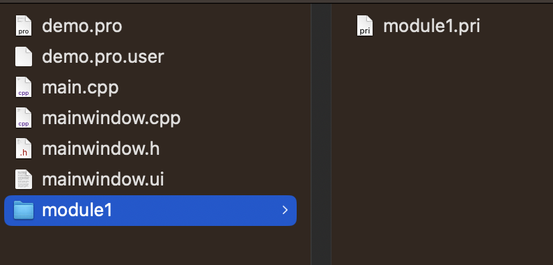
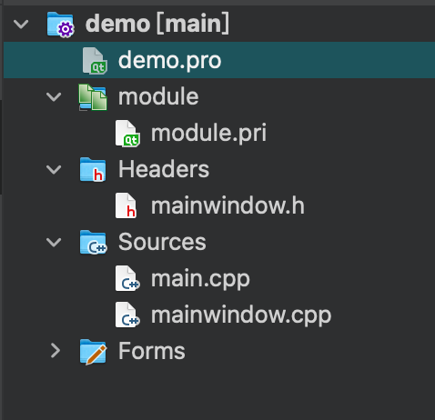
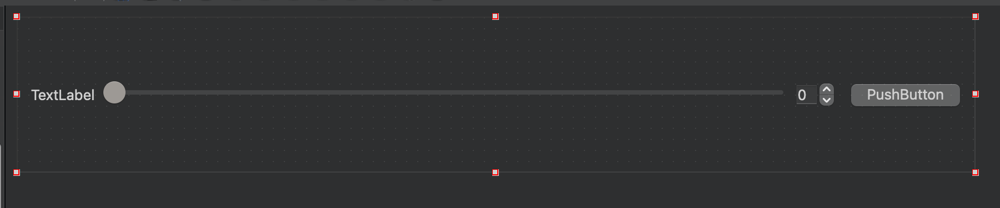
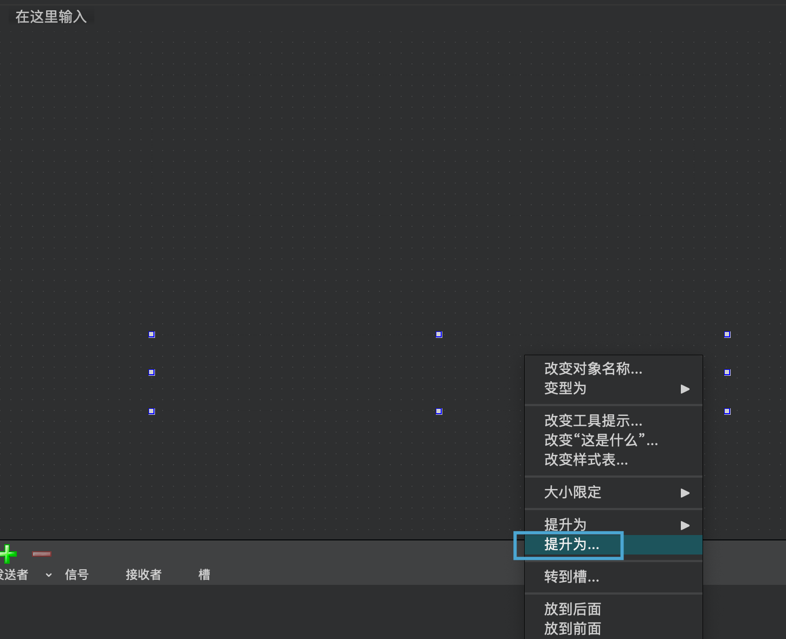
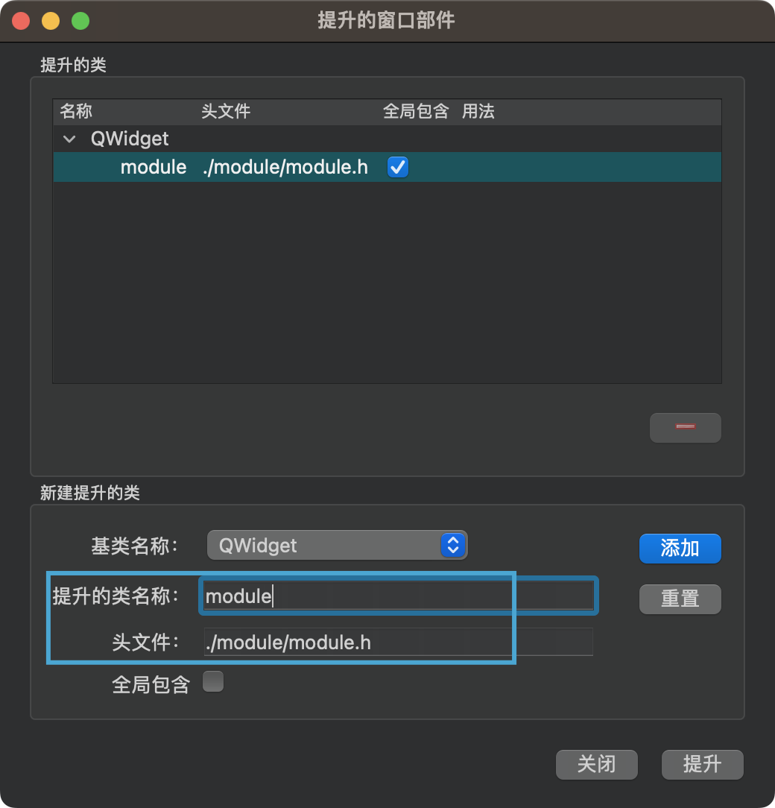
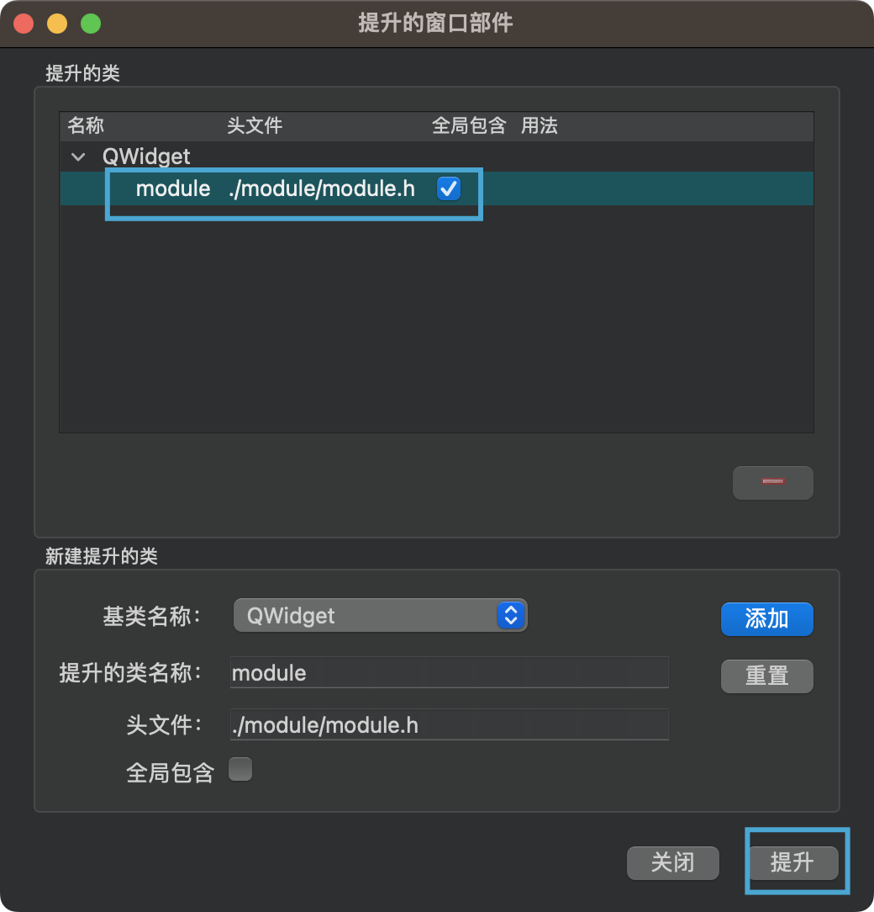
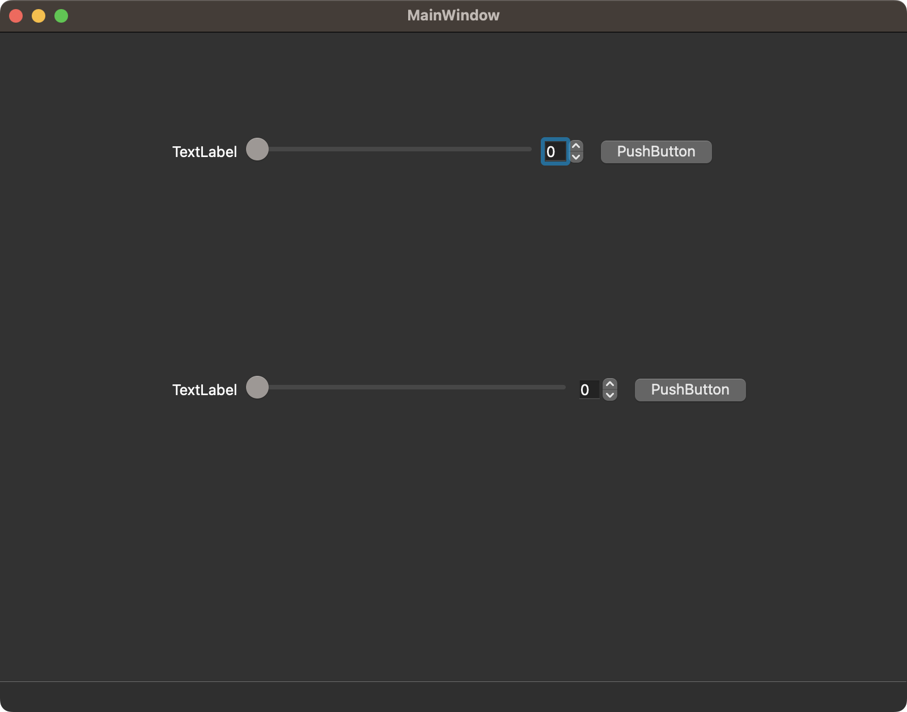

### 引言
Qt使用qmake构建项目.qmake语句在.pro文件里.qtcreater根据这个文件的内容来配置项目.同理,直接更改这个文件也可以自由的更改项目配置.
### .PRO文件
```cpp
QT       += core gui

greaterThan(QT_MAJOR_VERSION, 4): QT += widgets

CONFIG += c++17

# You can make your code fail to compile if it uses deprecated APIs.
# In order to do so, uncomment the following line.
#DEFINES += QT_DISABLE_DEPRECATED_BEFORE=0x060000    # disables all the APIs deprecated before Qt 6.0.0

SOURCES += \
    main.cpp \
    mainwindow.cpp

HEADERS += \
    mainwindow.h

FORMS += \
    mainwindow.ui

# Default rules for deployment.
qnx: target.path = /tmp/$${TARGET}/bin
else: unix:!android: target.path = /opt/$${TARGET}/bin
!isEmpty(target.path): INSTALLS += target

```
可以看到一些`SOURCES`,`HEADERS`,`FORMS`这类的文件配置.
### PRI文件
我们通常需要更精细的文件结构.需要子工程概念的引入.
创建子工程文件夹.创建`.pri`文件.
在`.pro`文件里引入:
添加引入语句:
```cpp
include(./module/module.pri)
```
并保存pro文件.qtcreater就会自动重新组织项目.
现在只需要写子工程就可以了.
我们已经在qtcreater里看到这个子工程了.就不需要在qtcreater外进行文件操作了.只需要在大纲视图中创建新类即可.
### 使用子工程

如何在外部使用子工程内的类?主要是如何在设计师界面类中使用.
我们的module类是这样的:

想要在mainwindow中使用.
拖拽一个widget进来.右键.

提升为

这里输入你的类名和头文件的路径.注意不要写错.头文件的路径不要写错!把它添加进提升类列表中.
选择你刚刚添加的类进来,点击提升.

运行.效果就有了.
